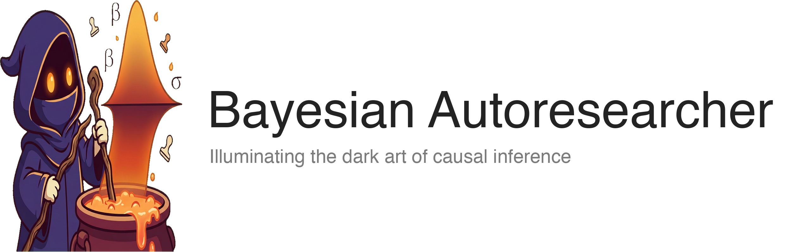
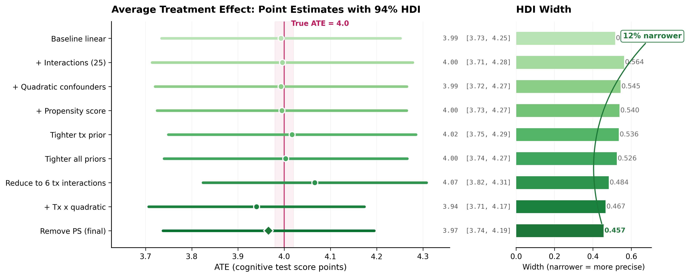
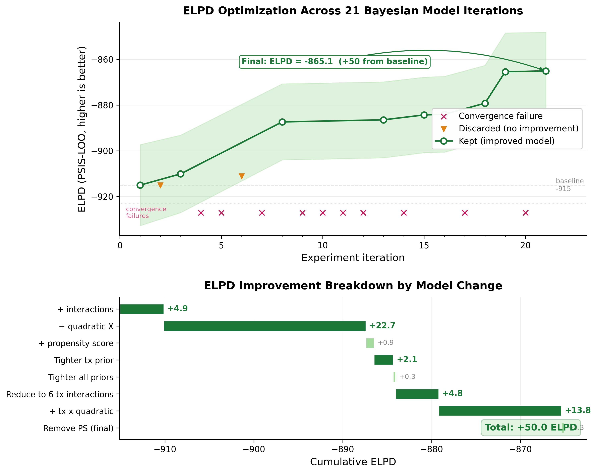
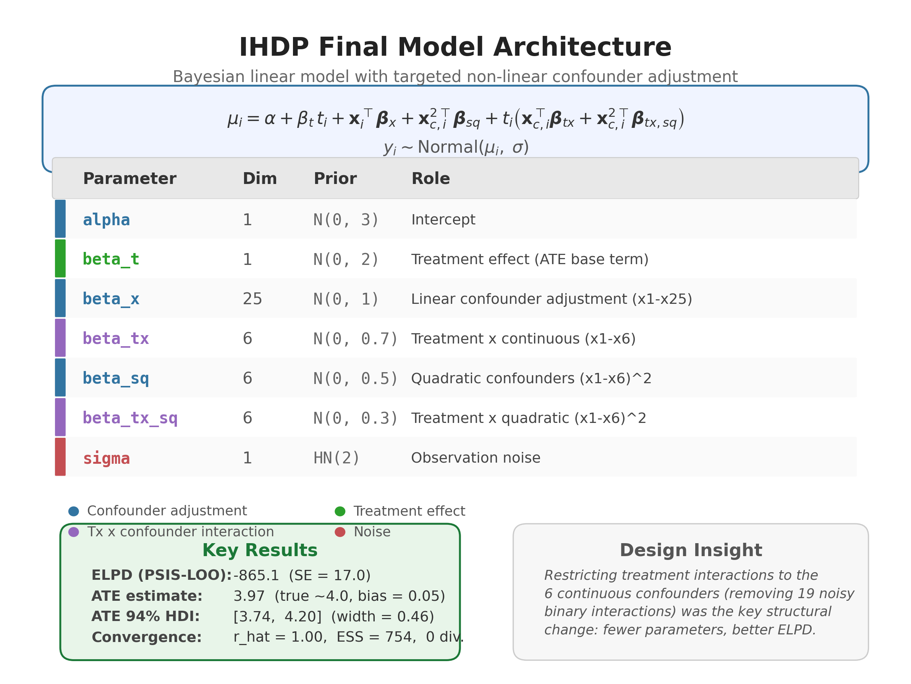
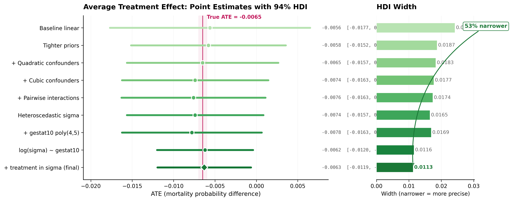
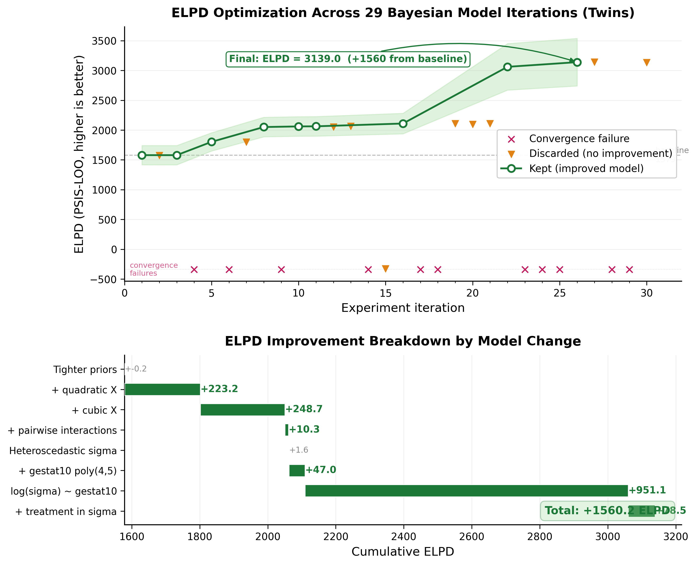
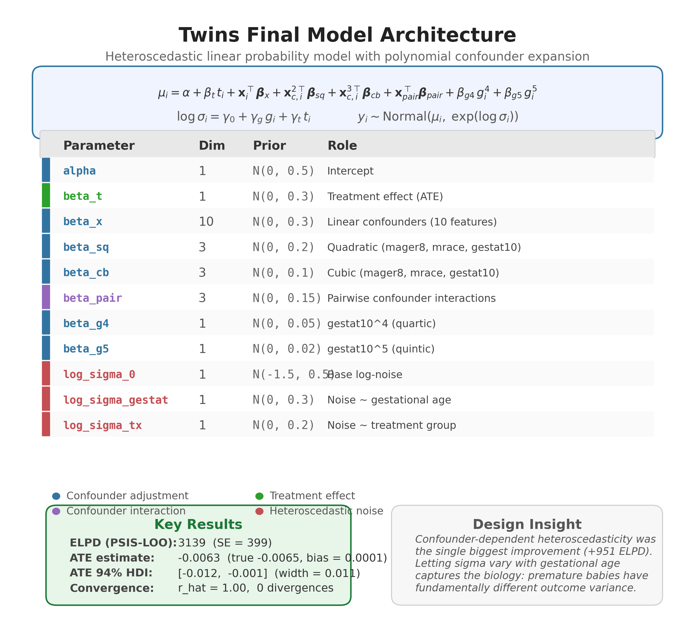

<p align="center">
  <picture>
    <source media="(prefers-color-scheme: dark)" srcset="images/banner-dark.png">
    <source media="(prefers-color-scheme: light)" srcset="images/banner-light.png">
    
  </picture>
</p>

<p align="center">
  <a href="https://lucafiaschi.com/blog/posts/bayesian-autoresearcher/"></a>
  <a href="https://www.linkedin.com/in/lfiaschi/"></a>
  <a href="LICENSE"></a>
</p>

<p align="center">
  <a href="https://www.python.org/"></a>
  <a href="https://www.pymc.io/"></a>
  <a href="https://github.com/pymc-devs/nutpie"></a>
  <a href="https://docs.anthropic.com/en/docs/claude-code"></a>
</p>

---

**Can an AI agent autonomously build Bayesian causal models?**

This project puts that question to the test. An AI agent (Claude) is given an observational dataset and a causal question — then left to iterate on [PyMC](https://www.pymc.io/) models entirely on its own. No human guidance during the loop. The agent formulates hypotheses about model structure, writes code, runs MCMC inference, evaluates results against proper scoring rules, and decides whether to keep or discard each change.

The goal is not just prediction — it's **causal inference**: estimating treatment effects with well-calibrated uncertainty from observational data where treatment assignment is confounded.

Read the full write-up: **[Bayesian Autoresearcher](https://lucafiaschi.com/blog/posts/bayesian-autoresearcher/)**

## How it works

Inspired by [Karpathy's autoresearch](https://github.com/karpathy/autoresearch), the agent runs a keep/discard loop:

```
LOOP:
  1. Review past experiments (what worked, what didn't)
  2. Formulate a hypothesis (e.g. "add quadratic confounder terms")
  3. Edit model.py (the only file the agent touches)
  4. Commit and run MCMC inference (nutpie, 5-min budget)
  5. Evaluate: convergence diagnostics, ELPD (PSIS-LOO), ATE estimate
  6. Keep (advance branch) or discard (revert commit)
  7. Go to 1
```

The agent optimizes **ELPD** (expected log pointwise predictive density via PSIS-LOO) as the primary metric — it uses all training data, naturally penalizes complexity, and needs no validation split. But the real measure of success is the quality of the **causal estimate**: how close is the ATE to ground truth, and how tight are the credible intervals?

## Datasets

Four causal inference benchmarks with varying complexity:

| Problem | N | Confounders | Outcome | Ground truth ATE |
|---------|---|-------------|---------|-----------------|
| **IHDP** | 747 | 25 (mixed) | Cognitive test score | ~4.0 |
| **Twins** | 5,000 | 10 (continuous) | Birth weight | ~-0.006 |
| **LaLonde** | 722 | 7 (mixed) | Earnings | ~$886 |
| **NHEFS** | 1,566 | 9 (mixed) | Weight change | 3-5 kg (literature) |

## Results

### IHDP

21 experiments, 8 kept. ELPD improved by 50 points. The agent discovered that restricting treatment interactions to continuous confounders and adding quadratic terms were the key structural changes — yielding an ATE of 3.97 (true: 4.0) with a 94% HDI width of 0.46.

<p align="center">
  
</p>

<details>
<summary>ELPD optimization trajectory</summary>
<p align="center">
  
</p>
</details>

<details>
<summary>Final model architecture</summary>
<p align="center">
  
</p>
</details>

### Twins

<p align="center">
  
</p>

<details>
<summary>ELPD optimization trajectory</summary>
<p align="center">
  
</p>
</details>

<details>
<summary>Final model architecture</summary>
<p align="center">
  
</p>
</details>

## Project structure

```
program.md          Orchestrator loop instructions (read by the agent)
scoring.py          CRPS, ELPD, MAE, convergence checks
runner.py           Shared experiment runner (sampling, scoring, comparison)
plotting.py         Shared publication-quality visualization utilities
problems/
  <name>/
    problem.md      Problem statement, variables, scoring config
    prepare.py      Per-problem data loader + runner entry point
    model.py        The ONLY file the agent edits
    visualize.py    Problem-specific plots (causal estimates, model diagrams)
    results.tsv     Experiment log (commit, ELPD, ATE HDI, status)
    data/           CSV datasets
    runs/           Saved InferenceData (best.nc, latest.nc)
```

The agent edits **only** `model.py`, which must expose three functions:

- `build_model(train_data)` — returns a `pm.Model`
- `predict(idata, model, new_data)` — returns posterior predictive samples
- `estimate_causal_effect(idata, model, train_data)` — returns ATE with posterior samples

## Quick start

```bash
# Install dependencies
uv sync

# Download datasets
uv run python download_datasets.py

# Run a single experiment
uv run python problems/ihdp/prepare.py

# Generate visualizations
uv run python problems/ihdp/visualize.py
```

### Running the autonomous loop

The agent loop is driven by Claude Code reading `program.md`. Start a session and tell it which problem to work on:

```
> Start experiments on IHDP
```

The agent will create an experiment branch, run the baseline, then iterate autonomously.

## License

This project is licensed under the Apache License 2.0. See [LICENSE](LICENSE) for details.
